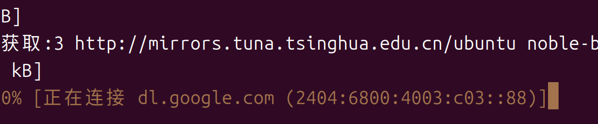
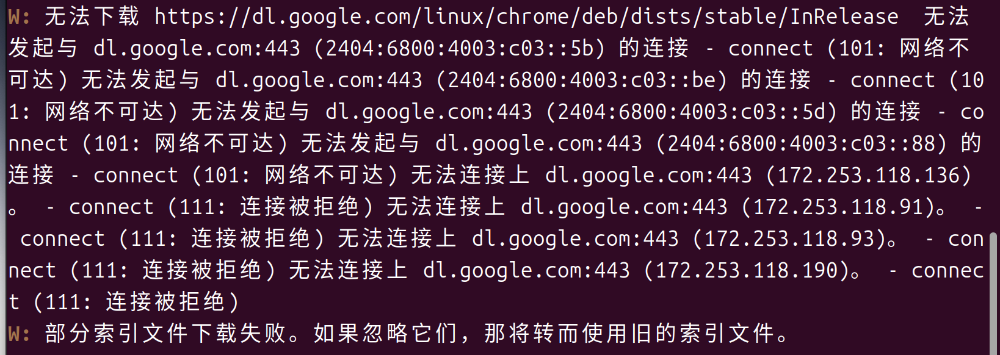
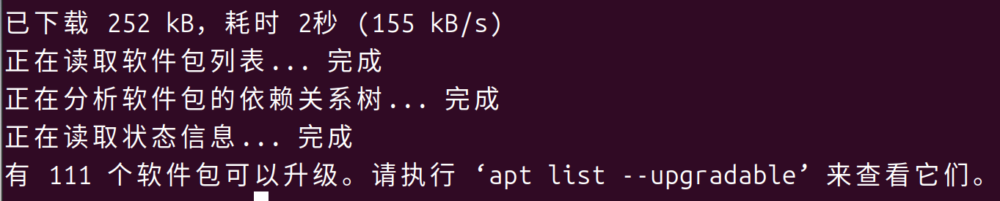

# 安装chrome浏览器后更新卡住

## 问题描述

安装完谷歌chrome浏览器后使用`sudo apt update`更新软件列表发现卡在图中这里



最后可能会出现下面的提示



**卸载chrome后依然存在**！

## 解决方案（）
**提示：** 适用于Debian/Ubuntu系Linux系统，
1.卸载chrome（也可不卸载）

```bash

# 1. 卸载Chrome，这会同时移除其软件源
sudo apt remove google-chrome-stable
# 2. （可选但推荐）清理残留配置
sudo apt autoremove
```
2.删除Google Chrome软件源
```bash
# 删除Google Chrome的源配置文件
sudo rm /etc/apt/sources.list.d/google-chrome.list
```
3.清理已下载的缓存
```bash
sudo apt clean
```
3.**执行完上述步骤后，重启**或者**重新登录**

## 再次执行更新命令，问题解决
```bash
sudo apt update
```


## CentOS系要注意！

|项目|Ubuntu/Debian|CentOS/RHEL|
|---|---|---|
|**配置目录**|`/etc/apt/sources.list.d/`|`/etc/yum.repos.d/`|
|**配置文件**|`.list` 后缀|`.repo` 后缀|
|**清理命令**|`apt clean`|`yum clean all`|
|**更新缓存**|`apt update`|`yum makecache`|

**核心思路完全一样**：找到问题源的配置文件，移除/禁用它，清理缓存。只是目录和命令不同。