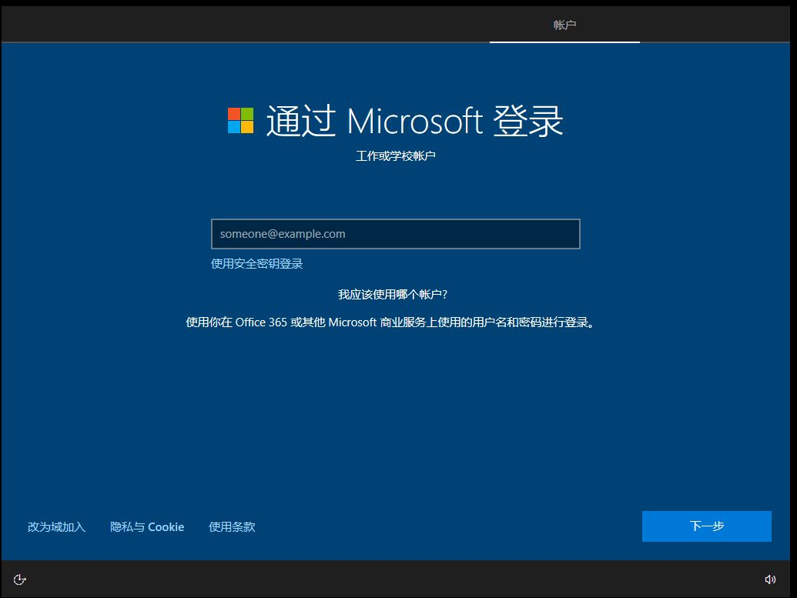

## 1. Windows桌面图标变白解决方案

win + r 输入`%localappdata%`打开 Local 文件夹，找到 IconCache.db 文件。删除，然后重启资源管理器。

## 2. Win + R常用指令速查

| 命令           | 功能说明                          |
| :------------- | --------------------------------- |
| `ncpa.cpl`     | **网络连接**                      |
| `regedit`      | **注册表编辑器**                  |
| `control`      | **控制面板**                      |
| `calc`         | **计算器**                        |
| `notepad`      | **记事本**                        |
| `mstsc`        | **远程桌面连接**                  |
| `services.msc` | **服务管理**：管理Windows后台服务 |
| `appwiz.cpl`   | **程序和功能**：卸载程序用        |
| `msinfo32`     | **系统信息**                      |
| `winver`       | **查看Windows版本**               |
| `gpedit.msc`   | **本地组策略编辑器**              |
| `sysdm.cpl`    | **系统属性**                      |
|  `osk`         |  **虚拟键盘**					|
| `mspaint` | **画图**	|

小提示：输入命令后不要直接回车，而是按 **Ctrl + Shift + Enter** 组合键，即可用管理员身份启动。

## 3. 关闭基于虚拟化的安全

不关闭这个功能导致虚拟机卡顿，还可能导致游戏卡

**如图：**


**解决方案：**

1. 下载工具

   地址：[Download Device Guard and Credential Guard hardware readiness tool from Official Microsoft Download Center](https://www.microsoft.com/en-us/download/details.aspx?id=53337)

2. powershell执行如下命令 ，选择y

   ```powershell
   set-ExecutionPolicy RemoteSigned
   ```

3. 打开powershell（管理员）cd 进入工具解压后的目录，执行如下命令

   ```powershell
   .\DG_Readiness_Tool_v3.6.ps1 -Disable
   # 看见红色的报错不用理会
   ```

4. 等待几分钟后重启电脑，会出现黑色提示界面。按两次F3确认。

4. 进入桌面后，win + r 输入 msinfo32 查看**基于虚拟化的安全**是否关闭

**注意Windows版本更新后都可能重新打开此功能**

各种常规方法关不掉的原因是，Windows11 24h2后强制开启了此功能
**[解决方案原贴](https://blog.csdn.net/weixin_46119529/article/details/136914993)**

**如果重启后又自动打开了，请看下面：**

[解决](https://help.ldmnq.com/docs/xu-ni-fu-wu-hyperv-guan-bi-jiao-cheng)

## 4. Windows下设置ssh登录服务器便捷操作

此方法用于解决在私人电脑上面需要登录服务器的时候每次都需要输入一大串内容

**步骤1：**

1. 右键用于登录的密钥文件文件，选择 **“属性”**。
2. 在属性窗口中，切换到 **“安全”** 选项卡，然后点击右下角的 **“高级”** 按钮。
3. 在“高级安全设置”窗口中，首先点击右下角的 **“禁用继承”** 按钮。
4. 在弹出的对话框中，选择 **“从此对象中删除所有已继承的权限”**，然后点击“确定”。此时你会看到权限条目被清空。
5. 现在权限列表是空的，我们需要添加自己。点击 **“添加”** 按钮。
6. 点击 **“选择主体”**。
7. 在“输入要选择的对象名称”框里，直接输入你**当前登录的Windows用户名**（如果你不确定，可以按 `Win`键，点击右上角的头像查看）。输入后点击 **“检查名称”**，系统会自动补全格式，然后点击“确定”。
8. 在“基本权限”区域，**只勾选“读取”** 这一项（这是最关键的一步）。然后点击“确定”。
9. 现在你回到了“高级安全设置”窗口，应该能看到一条记录：**你的用户名 - 读取权限**。点击 **“确定”** 关闭这个窗口。
10. 最后，点击属性窗口的 **“确定”** 按钮。至此，私钥文件的权限就设置好了。

**步骤2：**

对 C:\Users\用户 里面的.ssh文件夹里面的config文件设置同样的权限。没有就自己创建一个

*config里面的内容如下：*

```
Host test \\ 自定义的别名
  HostName 服务器IP或者域名
  IdentityFile 密钥绝对路径
  User ddgmmf
```

**步骤3：**

最后在cmd或者powershell窗口里面输入如下内容：

```cmd
ssh test
```

## 5. 资源管理器卡死

问题描述：打开此电脑点击任何一个盘符直接卡死，桌面任何一个文件夹打开就卡死。只能手动在任务管理器里面重启资源管理器

**解决方案1：**

1. win + r 输入 `services.msc` 打开服务。
2. 找到 **Windows Search** 的服务项，右键启动项将其设置为**禁用**。
3. 在属性里面的恢复选项卡，将第一第二后续失败设置为**无操作**

这样问题应该解决了，没有就重启一下电脑

**解决方案2：**

这个问题通常是**搜索索引损坏**引起的，也可以通**重建索引**来解决。

> 前往 **设置 > 隐私和安全性 > 搜索 > 高级索引选项 > 高级 > 重建**
>
> **提示：**此方案需要较长时间，可能需要几个小时

## 6. 突破Windows暂停更新5周限制

问题描述：Windows更新暂停只能设置最长5周时间，如果需要设置超过5周时间

**可以通过修改注册表来解决：**

1. `Win + R` 输入 `regedit` ，打开注册表
2. 导航到如下路径（如果`WindowsUpdate` 不存在，请手动创建）：
   * HKEY_LOCAL_MACHINE\SOFTWARE\Microsoft\WindowsUpdate\UX\Settings
3. 新建一个叫 `FlightSettingsMaxPauseDays` 的**32位**值
4. 将此值的**基数**设置为**十进制**，输入想暂停的整数天数

关闭注册表后，打开暂停天数的位置就能看见更多天数了

## 7. 关闭笔记本休眠功能，释放C盘空间

```powershell
# 1. 彻底关闭休眠功能，并删除休眠文件
powercfg /hibernate off
# 想重新打开
powercfg /hibernate on
```

执行完命令后，系统会自动关闭休眠功能并删除C盘根目录下的 `hiberfil.sys` 文件

## 8. VSCode 配置C/C++环境

1. [MinGW直达下载网址](https://sourceforge.net/projects/mingw-w64/files/Toolchains%20targetting%20Win64/Personal%20Builds/mingw-builds/8.1.0/threads-posix/seh/)
2. 下载完成后得到一个压缩包，解压出来将得到的`mingw64`文件夹复制到下面路径

```
C:\Program Files\
```

3. 复制完成后，进入mingw64文件夹内的`bin`目录，复制bin所在目录
4. 添加一条系统环境变量，内容就是刚刚复制到路径
5. 验证是否安装成功，在命令提示符内输入

```
gcc --version
```

6. 打开vscode随便写一段c程序，点击上方弹出的界面就完成了

## 9. VSCode 代码片段

1. 按 `F1` 或 `Ctrl + Shift + P` ，输入 `Preferences: Configure User Snippets`

2. 选择你要设置的语言类型

3. 在打开的 json 文件中，输入以下内容

```tex
\\ C
{
 "C File Header and Main": {
  "prefix": "startc",
  "body": [
   "/**",
   " * @file ${TM_FILENAME}",
   " * @author Your Name (your@email.com)",
   " * @brief ${1:简要描述这个文件的功能}",
   " * @version 0.1",
   " * @date ${CURRENT_YEAR}-${CURRENT_MONTH}-${CURRENT_DATE}",
   " */",
   "",
   "#include <stdio.h>",
   "#include <stdlib.h>",
   "",
   "int main(void) {",
   "\t${2:printf(\"Hello, World!\\n\");}",
   "\t",
   "\treturn 0;",
   "}"
  ],
  "description": "生成带标准文件注释和主函数的C代码结构"
 }
}

\\ java
{
 "Java Main Method": {
  "prefix": "mainj",
  "body": [
   "public static void main(String[] args) {",
   "\t${1:System.out.println(\"Hello, World!\");}",
   "}"
  ],
  "description": "在类内部生成main方法"
 }
}
```

## 10. VSCode 里面激活虚拟环境失败

**激活虚拟环境**提示：'Activate.ps1' cannot be loaded（无法加载）

```powershell
# 1. 获取当前执行策略（确认状态）
Get-ExecutionPolicy
# 2. 修改当前进程的执行策略（一次性）
Set-ExecutionPolicy Bypass -Scope Process
# 2. 修改当前进程的执行策略（永久，仅当前用户）
Set-ExecutionPolicy RemoteSigned -Scope CurrentUser
# 3. 再次尝试激活虚拟环境
```

## 11. Sublime Text 汉化指南

1. 按下快捷键 `Ctrl+Shift+P` 打开命令面板
2. 输入 “Install Package Control”，回车安装包管理器
3. 再次打开命令面板，输入 “Install Package”，回车
4. 在出现的输入框中输入 “ChineseLocalizations”，回车安装

## 12. 格式化注意事项

**文件系统：**

* **NTFS（默认）** 就像一个大公司的现代化仓库：
  * 支持超大文件（单文件 >4GB）
  * 有权限管理（谁可以拿货）
  * 自带日志（停电也不乱）
  * Windows/Linux 都能读写（Linux 要装驱动）
* **FAT32**
  * 老式小仓库，单文件不能超过4GB，U盘常用但淘汰了
* **exFAT**
  * 升级版小仓库，支持大文件，适合U盘/移动硬盘跨平台（Windows/Mac/Linux 都原生支持）

**建议：**

* 装系统/装软件 → **NTFS**
* U盘给不同设备传文件 → **exFAT**（兼容性最好）
* 老古董设备（相机/老电视）→ **FAT32**

**分配单元大小：**

|           大小            | 优点                     | 缺点                         | 适合场景                   |
| :-----------------------: | :----------------------- | :--------------------------- | :------------------------- |
|   **小格子（如 512B）**   | 不浪费空间（存小文件时） | 读写慢（要翻很多格子）       | 存大量小文件（代码、文档） |
|   **大格子（如 64KB）**   | 读写快（一次性搬大货）   | 浪费空间（小文件也占一大格） | 存大文件（视频、ISO镜像）  |
| **默认 （4096字节,4KB）** | 平衡                     | 平衡                         | 日常使用                   |

## 13. 解决Google浏览器翻译功能不可用

**第一步：获取最新的可用IP地址**

```powershell
nslookup translate.googleapis.com 8.8.8.8
nslookup translate.googleapis.com 1.1.1.1
```

观察结果，选择一个**延迟低且能解析出IP**的地址。

**第二步：修改hosts文件**

hosts文件地址：C:\Windows\System32\drivers\etc

用记事本打开hosts（管理员），文件末尾**另起一行**，添加以下内容（将 `142.250.196.202`替换为刚才查到的IP）：

```
142.250.196.202 translate.googleapis.com
```

**第三步：刷新DNS缓存**

```powershell
ipconfig /flushdns
```

这个方案不好用经常失效，建议直接安装“**沉浸式翻译**”插件

## 14. 解决重置系统后需要登录微软账户问题



请用下面这个**最快且最有效**的方法直接跳过：

1. 在当前登录界面，按下键盘上的 **`Shift + F10`**（部分笔记本电脑需要按 **`Shift + Fn + F10`**），会弹出黑色的命令提示符窗口。

2. 在黑框里输入以下命令（直接复制粘贴或手动输入），然后按回车键（Enter）：

   ```cmd
   cmd
   start ms-cxh:localonly
   ```

3. 屏幕会直接跳转到一个创建本地账户的输入界面。

4. 填入你想要的用户名和密码，创建完成后就能直接进入桌面了，完全不需要输入微软邮箱。

*(备选方案：如果你上面那个命令没反应，就用这个。按 `Shift + F10`打开黑框，输入 `oobe\bypassnro`并回车，系统会重启。重启后在连接网络的步骤，选择“我没有Internet连接”，就能进入本地账户设置。)*

## 15. 解决VMware Win7虚拟机不能安装vmwareTool

1. 先在虚拟机设置里面将**软盘**设备移除
2. 尝试重新安装
3. 如果提示**驱动**有问题
4. 需要安装**SHA-2 签名支持补丁**(地址：https://www.catalog.update.microsoft.com/search.aspx?q=kb4474419)
5. 将下载的补丁传入虚拟机双击安装（如果u盘不识别看下面）

**怎么传入？**有如下三种方式：

* 通过 ISO 镜像文件传输
* 通过U盘（建议）
* 使用网络共享

**两个注意点（可能出现）：**

1. 要保证U盘文件系统是 **FAT32**，新装win7可能不识别其他两种！
2. 新装win7没有补丁，不能识别USB3.0接口！

如果虚拟机就是不能识别到U盘，尝试卸载VMware后重新安装！

**原理：**微软在 2019 年将驱动程序签名算法从 SHA-1 升级到了 SHA-2，而原版 Windows 7 并不支持这种新签名，导致 VMware Tools 中的新驱动无法通过系统的签名验证，从而安装失败

## 16. Win11恢复win10右键菜单

1. **管理员运行终端**
2. `reg add "HKCU\Software\Classes\CLSID\{86ca1aa0-34aa-4e8b-a509-50c905bae2a2}\InprocServer32" /f /ve`
3. 重启电脑或者资源管理器

**恢复：**

```powershell
reg delete "HKCU\Software\Classes\CLSID\{86ca1aa0-34aa-4e8b-a509-50c905bae2a2}" /f
```

